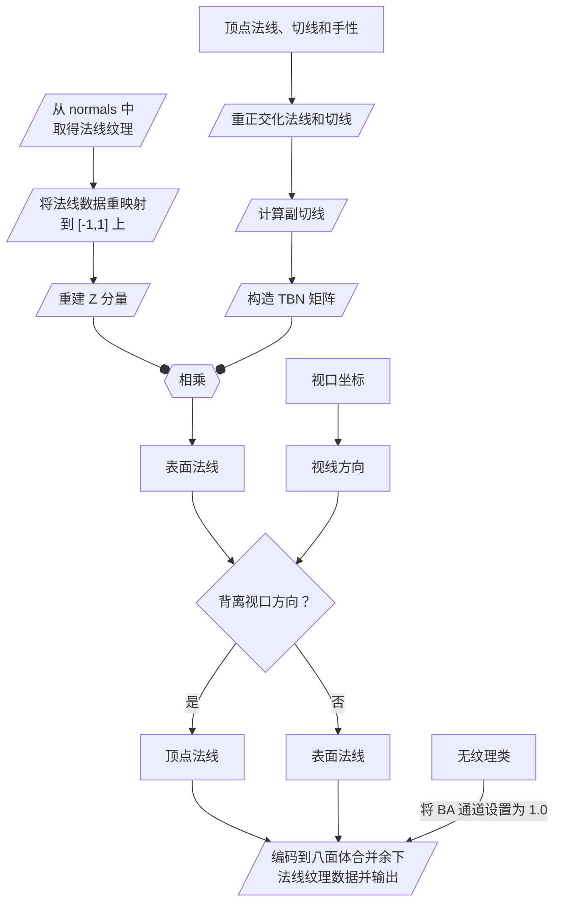
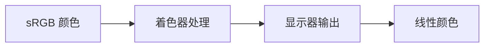

# 进阶延迟处理：光照

<show-structure depth="3" for="chapter"/>

<tldr>

在之前的章节中，我们完成了场景的初步光照，当然，这个光照依然很简陋，基本都是在原版游戏上很有限的“扩写”。我们目前所做的光照一直拘泥于顶点数据，而且明暗对比也很逊色。

在这一节中，我们将着手优化场景的光照效果，引入更多细节。

本节的内容较多，因此会拆分为两个部分，第一部分我们主要聚焦于光照本身，而第二部分我们则聚焦于环境和其他处理。

</tldr>

## 光照模型

目前我们的几何表面都只有简单的纹理颜色和受光强度，也就是所谓 {style="inline" width="24"} **漫反射**（Diffuse）。现在，我们将添加更多效果，来让场景的光照层次更加丰富。

### 高光

在现实生活中，如果一个表面足够光滑，我们可以通过这些表面观察到清晰的景物倒影，也就是**反射**（Reflection）。而那些明亮光源在光滑表面上反射带来的亮斑，就被称为 {style="inline" width="24"} **镜面高光**（Specular highlight）。

在着色器中实现完整的镜面反射比较麻烦，对于我们来说还为时尚早，但是高光则非常简单，我们只需要知道高光产生的位置即可。我们已经拿到了光源的位置和几何表面的法线信息，回忆一下我们小学二年级就学过的反射虚像的位置，很显然它就在以几何表面为对称轴的镜像光源位置。

GLSL 为我们提供了一个用来反射向量的函数 `reflect(vec3 I, vec3 N)` ，其中 `I` 表示被反射向量，`N` 表示反射表面的法线，被反射向量即光源相对片元的方向。和之前一样，对于平行光来说，光源的方向就是光源相对片元的方向。这样，我们就直接求到了高光反射的方向：
```glsl
vec3 reflectDir = reflect(lightDir, normal);
```

因为表面通常不会绝对光滑，因此轻微的偏移只是会造成片元产生的高光减弱，不会导致平面上只有一个点能看见光源虚像，换句话说，高光会漫开，漫开强度取决于我们的视线 ^**1**^ 靠近反射中的光源方向的程度以及表面的粗糙程度。说到两个向量的靠近程度，自然而然的，我们就能知道需要将高光方向与视线方向进行点乘。每个片元与我们摄像机的差值就是当前片元的视线方向，因此我们只需要求得当前片元相对摄像机的方向与反射目标方向的同向程度，就可以算出高光的强度了。为此，我们还需要知道当前片元的方向。

**[1]** 这里的视线不单纯是我们摄像机和眼睛聚焦的中央区域或者说“朝向”，而是我们整个可视范围内所有与观察点的连线，因此会有朝向一个方向时一些视线靠近反射高光方向，另一些视线背离反射高光方向的情况。大部分的空间效果都是视线敏感的，只有小部分屏幕整体特效是朝向敏感。

光源坐标都在视口空间中，因此我们同样只需要求得视口空间的片元方向即可。在视口空间中，摄像机的坐标始终是 $(0,0,0)$，因此片元的方向就是简单的片元坐标归一化。

片元的视口坐标在之前处理阴影空间时短暂出现过，希望你还记得：
$$
P_\text{View} \xleftarrow{透视除法} {P_\text{Clip}} \leftarrow M_{G\text{Projection}}^{-1} \cdot P_\text{NDC} \leftarrow P_\text{Screen} \times 2 - 1
$$
在 [那一节](1-4-realtimeLighting.md#rebuildCoord){summary=""} 中，我们也将 `viewPos` 进行了保留，如果你没有保留，可以回去翻找或者按上式自行计算。

最后，我们将视口方向与反射方向进行点乘，就可以在场景中产生高光了：
```glsl
vec3 viewDir = normalize(viewPos.xyz);
lit += max(dot(viewDir, reflectDir), 0.0);
```

> 在 Learn OpenGL 的教程中，对于 `reflectDir` 和 `viewDir` 被解释为了每个片元的出射光方向和片元朝摄像机的方向，因此它考虑的是片元出射光偏离视口的角度。这和我们考虑的高光虚像产生方向与视线观察方向的角度是等效的，只不过我们的向量按来源是首尾相接，在图上计算夹角时需要移动一个向量到尾尾相连。

{width="700"}

你可以看出画面中“靠近”太阳的左侧地面产生的反射明显比右侧更亮，但是这个效果仍然很微妙。如果我们想产生更强烈和集中的高光来模拟光滑表面呢？很简单，我们只需要给点乘结果一个指数幂。

回想一下幂函数 $x^a , a > 0$ 在区间 $[0,1]$ 上曲线随 $a$ 的变化规律，当 $a$ 逐渐增加，$x = 0$ 和 $x = 1$ 的值始终不变，而整条曲线会越来越下凹，即前半部分的增长会越来越放缓，而靠近 1 的部分会升得更快。这和我们高光的变化就非常相似了，远离光源的地方光照强度接近 0，而靠近光源的地方光照强度则会迅速增长到 1。因此，我们只需要给光照结果一个大于 0 的指数幂即可产生更加锐利的高光。

GLSL 同样为我们提供了幂函数 `pow(<gtype> x, <gtype> y)` ，其中 `x` 是底数，`y` 是指数，底数和指数需要同维。我们只需要将它套在运算结果之外即可，为了产生锐利的高光斑，我们将指数设置为了一个较大的值：
```glsl
lit += pow(max(dot(viewDir, reflectDir), 0.0), 256);
```

{width="700"}

可以看到，地面上已经产生了很明显的光斑了，与我们之前完成的漫反射和环境光照结合起来，就是所谓**冯氏光照**（Phong Lighting）。

> 如果你尝试在几何缓冲的顶点着色器中处理这些光照特效，由于只能在顶点位置上计算高光强度，附近区域则依赖于插值，最终的效果会大打折扣，这种高光被称为**高洛德光照**（Gouraud Lighting）。

### 材质

每种物体的表面都有不同的质地，它们有些是金属的，有些很光滑，这就是它们的**材质**（Material）。光线在不同的材质上会呈现不同的行为，最终反射出来的像也会有所区别。回看我们刚才写好的高光反射，在草方块上这样突兀的一团反射让它看起来非常滑溜，而且还有点金属的味道。我们更希望针对不同的纹理定制不同的材质，从而产生不同的反射观感。

除了普通的颜色纹理，OptiFine 还会额外读取两种特殊后缀的贴图，即资源包中每张普通贴图同位置下与之同名且附带后缀 `_s` 或 `_n` 的贴图。其中，`_s` 就被 OptiFine 定义为了**高光纹理**（**S**pecular texture），它定义了几何表面的材质。在几何缓冲中，我们使用
```glsl
uniform sampler2D specular;
```
就可以访问它。和 `gtexture` 类似，它们也会在相同的位置进行拼贴，因此可以使用相同的 UV 进行采样。我们已经使用了 0 ~ 4 号缓冲区（有些人可能在之前还为自发光单开了一个缓冲区），因此材质数据我们就顺理成章地保存在 5 号缓冲区中了。

我们只需要为每种几何缓冲程序添加一个输出目标，然后接在之前纹理写入的末尾即可。
```glsl
[... 片元着色器部分 ...]
/* DRAWBUFFERS:...5 */
[...]
layout(location = [DB:5的索引]) out vec4 spec;
[... main ...]
spec = texture(specular, fs_in.uv);
```

特别注意 `gbuffers_color_only.glsl` 中的特殊处理，我们需要根据是否有纹理来决定是否写入高光缓冲区：
```glsl
#ifndef TEXLESS
/* DRAWBUFFERS:05 */
layout(location = 0) out vec4 fragColor;
layout(location = 1) out vec4 spec;
#else
/* DRAWBUFFERS:0 */
layout(location = 0) out vec4 fragColor;
#endif
```

> 高光纹理的每个通道都表示了固定的材质属性，因此你需要斟酌保留半透明几何的材质信息还是保留它背后的固体几何材质信息。为了方便，我们就保留半透明几何的数据了。
> 
{style="note"}

如果你没有为着色器程序设置混合模式，或者在之前偷懒将某些程序的混合模式做了统一修改，那么你还需要更改缓冲区的混合方式：
```properties
blend.<program>.colortex5 = off
```
当然，如果你在没有安装任何额外资源包的情况下直接在延迟处理中读取它的话会发现什么都没有，因为 OptiFine 默认将不存在的高光贴图设置为了 `vec4(0.0)`。现在，你应该前往 [图形站](https://www.minegraph.cn/) 或者 [Modrinth](https://modrinth.com/) 或者 [CurseForge](https://www.curseforge.com/minecraft/search?page=1&pageSize=20&sortBy=relevancy&class=texture-packs) 或者任何什么能下载到资源包地方，下载任意支持高光贴图的资源包 ^**1**^ 。如果你拿不定主意，可以试试 [SPBR](https://modrinth.com/resourcepack/spbr/versions)，他是基于原版纹理的 PBR 资源包，支持高光贴图和我们之后会用到的法线贴图。

**[1]** 现代大多数光影都使用 [PBR](terms.md#pbr){summary=""} 系统，所以这类资源包也常被称为 PBR 资源包，以前它们叫高光包（Specular Pack）。

安装好之后，重载一下光影，你就能在游戏中看到效果了：

{width="700"}

我们的教程将会使用 [LabPBR 格式](labpbrMaterialStandard.md)，这是目前社区中 Java 版光影和资源包常用的格式，它定义了每个通道的数据用于处理何种效果，我们先前下载的 SPBR 也是这个格式（你不会下了其他的吧……）。

现在让我们先着眼于表面的平滑度，表面越光滑，我们之前的指数也就越大。LabPBR 不使用粗糙度，而是使用**感知平滑度** ^**2**^。其保存在了红色通道中，因此我们只需要在后处理中先读取材质信息，再将对应分量信息添加进光照函数中。

```glsl
vec4 material = texture(colortex5, uv);
[...]
lit += pow(max(dot(viewDir, reflectDir), 0.0), 1024. * material.r);
```

**[2]** $ \mathrm{粗糙度} = (1 - \mathrm{感知平滑度})^2 $

需要注意的一个问题是：如果光滑度和点乘同时趋于 0，就会出现 $0^0$ 的情况，这在 GLSL 中是未定义的，而就算点乘大于 0，也会出现 $x^0 = 1$，导致高光过度叠加。我们可以钳制光滑度的最小值来避免 $0^0$，同时将光滑度额外乘到末尾来避免出现 $x^0=1$ 的情况。
```glsl
float smoothness = 1024. * material.r;
pow(max(dot(...)), smoothness) * 2.0 * pow(smoothness, 2);
```

这里我们再次提高了固定倍数的值，因为现在我们的高光强度是可变的了，高平滑度的表面可以放心地产生更锐利的高光：

{width="700"}

### 高光优化

现在让我们来看这样一个纯镜面高光场景，我们的位置和光源几乎处于观察点的同一侧，而地面非常粗糙，结果就会像这样：

{width="700"}

眼尖的你应该已经发现了，高光的边缘过渡变得非常难看。这是因为当我们与光源位于观察点同一侧时，我们与反射光的夹角大于了 90°。对于完美的光滑平面来说这是没有问题的，但是对于一个粗糙的表面呢？

{width="700"}

这里我们提前引入**微平面**（Micro Facets），一个在 PBR 渲染中常用的概念。我们的纹理分辨率是有限的，因此用于存储表面额外朝向的信息最多只能记录到纹素尺度，那么对于小于一个纹素尺度上的法线，我们只能使用粗糙度来表征它们在已有法线朝向附近的统计学分布 ^**1**^。因此那些看似夹角大于 90° 的区域，当粗糙度足够高时，实际上也是会有部分微平面的反射光进入视口，而不只是一片纯黑。

**[1]** 我们的光照系统只能处理各向同性的情况，即在给定粗糙度的情况下，微平面的法线在粗糙度范围内的各个方向上的分布是均匀的。

> 你可能会思考，既然都是反射，那高光反射为什么不同样用于漫反射？这是因为所谓的“漫反射”实际上指的是光线进入材料的表层内部经过多次吸收和释放（即散射）之后，逃逸出材料的表面并向四面八方扩散，最终被我们的眼睛接收的光线，因此每个点的散射亮度理论上在各个方向上都是均匀的。
> 
> 当我们从掠角（即与平面几乎平行）进行观察时，微几何自身会形成自遮蔽，但是它们本身又会进行散射和反射来照亮周围，而掠角时漫反射贡献又微乎其微，再加上许多物质在有一些不是很高的厚度时，散射光照就无法穿透其背面和侧面。虽然在最小微元上入射方向只有命中原子与否，但在更大的尺度上，我们将所有这些现象归因进 $n \cdot l$，即光照方向与法线的点积中，这样，当表面朝向背离光源时，漫射光就会逐渐减少。
> 
> 当然，为了让那些散射强度很大以至于会从物体侧面和背面逸出，从而形成光照的材质，比如皮肤和树叶看起来更加“真实”，次表面散射就派上用场了。
> 
> 而“高光反射”（我们更习惯于称为镜面反射），则是真正意义上没有被材料吸收，仅在材料表面进行反弹之后就扩散到四周的光线，粗糙度就表征了反弹方向相对表面朝向的离散程度，某些 PBR 系统还拆分出了几何粗糙度和表面粗糙度用于表面的自遮蔽和反射扩散程度。当我们的视线越靠近光线的扩散范围，会接收到的光照理应就更多。
> 
> 事实上，反射也会受到光照角度的影响，因为入射光的总量会变少，但现实生活又告诉我们，反射光会在从掠角进行观察时看起来更加明显，我们一会儿就会解释它们。
> 
{title="小知识"}

来做这样一个思想试验，现在有一个平面，平面上空的左侧有一个光源，而我们的视口位于右侧。让我们在光源、视口和平面上一条法线的二维平面上来研究一下。

假如初始时平面完全光滑，我们能从平面内看到的光源就只有一个点（假设就是视口上的一个像素），这时，光源虚像与视口连线和平面交点上的法线就正好平分了光源与视口的夹角。

{width="700"}

现在，平面的粗糙度逐渐增加，每个纹素上的众多微平面就会开始和原本的表面法线产生微微的偏离。由于**我们的视口不止一个像素**，视线的方向也就不止一个（广度和密度与 FOV 和屏幕分辨率有关），现在，“能看到反射虚像的那个像素”附近的那些像素，也会因为某些微平面朝向正好微微偏移到视口和光源的半程上而“看见”光源的虚像。

{width="700"}

如果粗糙度继续增大呢？当然，就会有越来越多的视口像素有概率（我们暂时不关心整体概率，只要有概率就行）看到这个光源的虚像。

从这里你也可以知道了，每一个能在像素中映出光源虚像的微平面，它们的朝向都有一个共同点：在视线和光源方向夹角的**一半方向**上。这就是所谓的**半程向量**（Halfway Vector）。

{width="700"}

随着半程向量与表面本来的法线相背离，由于粗糙度不够高，微平面偏移到半程向量方向的概率会逐渐减小，能映出光源虚像的概率就会降低。无论光源和视口怎么变化，只要两者都在反射面的同一侧，半程向量与法线的夹角就始终不会大于 90°！因此，我们可以将半程向量与法线做点乘，这就是大名鼎鼎的**布林-冯氏光照**（Blinn-Phong Lighting）。

要想求得半程向量非常简单，只需要将片元指向光源的方向与片元指向视口的方向进行平均即可，再加上我们使用两个单位向量求一个单位向量，因此也不需要除以平均值，只需要简单的归一化。光源方向我们已经有了，片元指向视口的向量即片元的视口坐标取反：
```glsl
vec3 viewportDir = normalize(-viewPos.xyz);
vec3 halfwayVec = normalize(lightDir + viewportDir);
```

此外，求半程向量时我们一定要记得归一化，否则半程向量的方向就会朝两者更长的方向偏移。最后，我们将半程向量与法线做点乘，并像冯氏光照那样为高光强度添加一个经验系数，新的高光效果就出来了：
```glsl
float smoothness = max(material.r, 0.001);
float blinn = dot(normal, halfwayVec);
blinn = pow(max(blinn, 0.0), 1024. * smoothness);
blinn *= 2.0 * pow(material.r, 2.0));
```

{width="700"}

布林-冯氏光照相比较于单纯的冯氏光照会更加明亮和平滑，因为半程向量与法线的夹角相对变化更慢，在球上的高光扭曲程度也会因此减弱，可以使用 4 倍的指数来勉强对齐冯氏光照的观感。

{width="512"}

最后一件事，如果你和光源在表面的两侧，可能会观察到下图的问题：

{width="700"}

这是由于半程向量始终在两方向所成的劣弧上（两向量平行时甚至可能导致 `normalize()` 除 0），而劣弧几乎总是会覆盖视口侧，这就导致了半程向量与法线的夹角有很大概率会小于 90°：

{width="700"}

解决这个问题也很简单，只需要判断表面是否和光源同侧即可：
```glsl
blinn = dot(lightDir, normal) > 0.0 ? blinn : 0.0;
```
当然，这样会在光照方向接近掠角时导致光照突变，我们一会儿再处理它。你也可以直接用先前计算的漫反射强度值直接进行判定，它们的公式是一致的。

### 让光照更“正确”

回看我们写出来的高光效果，我们还没能解决所有表面看起来都像金属的问题。这是因为我们单纯地将镜面反射叠加到了本来的光照强度上，这些高光在非金属材质上不应该总是如此明显，反射出来的光线也不应该受表面颜色本身影响 ^**1**^。

**[1]** 非金属的反射光与表面碰撞之后就逸出了，它们几乎不与材质产生交互。再者固有色或者说反照率在物理上是不包含反射部分的，我们通常看到的颜色都由漫反射提供，而反射则专注于产生与光源色彩几乎相同的明亮高光（和反射场景），这在上一节的小知识中已经讨论过了。

如果你仔细阅读了上一节中的小知识，或许会开始思考这个问题：既然几何表面接受到光照之后会产生漫反射和镜面反射，那在入射光强度一定时，漫反射和镜面反射的强度应该是此消彼长的，再考虑到材料内部散射被吸收的部分，总的出射光应该比入射光强度更弱。换句话说，漫反射和镜面反射的能量总和不应该大于入射光的能量，这就是**能量守恒**。

虽然这已经涉及到 PBR 了，但是我们暂时不做深入，也暂时不会将那个让人头大的 [渲染方程](terms.md#render_equ){summary=""} 搬过来解释半天。我们会沿用布林-冯氏光照的基本算法，并将其改造为简单的能量守恒光照，而不会使用完整意义上的 <tooltip term="BRDF">BRDF</tooltip>。

根据我们之前所说的，漫反射在各个方向上是均匀的 ^**2**^ ，而光照与表面法线的夹角应该同时影响镜面反射，我们会将它乘在整个光照函数的末尾，因此漫反射就只和材料的表面颜色（或者说固有色）有关了。

**[2]** $n \cdot l$ （法线与光照方向点积）项即是在拟合表面的受光强度，表面法线与光照的夹角越大，那么这个位置接收到的光照强度理应更小，因此在这里它描述的是表面随着朝向的背离导致接受到的光照强度变化。  

#### 菲涅尔现象

在之前的光照处理中，我们总是将高光反射与漫反射一视同仁，一同全量叠加在表面上。然而在现实中，当你从掠角（与表面几乎平行，与表面法线几乎垂直）观察几何表面时，你会发现非金属材质的反射要比视线与表面垂直时强得多，这被称为 {style="inline" width="24"} **菲涅尔现象**（Fresnel Effect）。

菲涅尔强度表征的是折射和反射的比例，而散射则是在非均质材质中的折射，而漫反射又来源于散射，因此菲涅尔方程可以用来计算漫反射和反射的比例。完整的菲涅尔相当复杂，我们就不列出了，幸好 Schlick 提出了一种近似方法，将其简化为了：

$$
F = F_0 + (1-F_0)(1-\cos\theta_i)^5
$$

而且其中的 $\cos\theta_i$ 就是半程向量和视线的点乘值，因此还可以改写为 $h \cdot v$。式中另一项令我们在意的是 $F_0$，它表征了当视线与表面垂直时的**基础反射率**，由 $\theta_i = 0$ 推导菲涅尔方程中的任意一个得到：

$$
\begin{aligned}
F_0 &= \left| \frac{n_1 \cos0 - n_2\sqrt{1-\left({\frac{n_1}{n_2} \sin0}\right)^2}}{n_1 \cos0 + n_2\sqrt{1-\left({\frac{n_1}{n_2}\sin0}\right)^2}} \right|^2 \\
&= \left| \frac{n_1 \times 1 - n_2\sqrt{1-\left({\frac{n_1}{n_2} \times 0}\right)^2}}{n_1\times 1 + n_2\sqrt{1-\left({\frac{n_1}{n_2}\times 0}\right)^2}} \right|^2 \\
&= \left|\frac{n_1-n_2}{n_1+n_2}\right|^2
\end{aligned}
$$

其中 $n_1 n_2$ 表示两介质的折射率。

要想准确计算材质的 $F_0$ 比较复杂，可以在 [RefractiveIndex.info](https://refractiveindex.info/) 的 _Fresnel reflection calculator_ 板块查询每种材质在观察角度为 0 时波长对应到 RGB 的 $R$、$R_s$ 或 $R_p$ 值即 $F_0$（$R = \frac{R_s + R_p}{2}$，观察角度为垂直表面时三个值相等）。非金属没有反射颜色，只需要计算一个值，而金属有色泽，因此需要在各颜色的波长段均进行计算。

#### 表面的金属性和 F~0~ {id="howF0Works"}

回看我们之前取到的表面材质信息，它的 Green 通道就表示了材质的所谓**金属性**（Metallic）。由于各种金属存在特定的色泽，因此 LabPBR 预留了 230 ~ 254 的区间用于定义金属材质，只不过目前只用到了 237。对于那些没有使用的硬编码值，我们将它们都视为纯金属，并且使用它们的表面颜色作为 $F_0$ ^**1**^。

**[1]** 金属的菲涅尔强度都较高，因此进入我们眼睛中的大多数金属色都来自镜面反射。由于许多纹理都按照表面颜色绘制，混合了反射和漫反射，将表面颜色挪用过来还有很不错的结果，而我们也不希望浪费纹理的数据，也就没什么理由不这么做了。

对于普通的非金属而言，我们可以将 $F_0$ 统一设置为一个小值。在很多教程包括万恶之源 LearnOpenGL 中，都将其设置为了 0.04，这以你自己的喜好为准。

而对于那些现实生活中不存在“半金属”，由于一个纹素无法表达多种材质，因此它们可以用来表示一些复合材质，比如嵌在沙堆里的金属碎屑，在这种情况下，随着金属性的增长，我们会以金属性为依据混合非金属 $F_0$ 与表面颜色，直到进入硬编码区间（229 / 255 时可以取到约 90% 的金属性）。当然，你也可以将小于硬编码区间开始的值用来仅控制 $F_0$，然后将硬编码未使用区间用于纯金属，这都是允许的。

LabPBR 还提供了每种硬编码材质的**复折射率**（Complex refractive index，$n+\mathrm{i}k$）查找表，实部表示折射率（Refractive index），虚部表示消光系数（Extinction coefficient），它也可以用来计算 $F_0$：

<include from="labpbrMaterialStandard.md" element-id="hardcode_metallic"/>

没错，我们之前所使用的介质折射率 $n$ 实际上都是复数。如果将 $n_1$ 代入空气折射率 $1 + 0\mathrm{i}$，$n_2$ 代入材料折射率，基础反射率 $F_0$ 就可以继续推导为：
$$
\begin{aligned}
F_0 &= \left| \frac{(1 + 0\mathrm{i}) - (n + \mathrm{i}k)}{(1 + 0\mathrm{i}) + (n + \mathrm{i}k)} \right|^2 \\
&= \left| \frac{1 - n - \mathrm{i}k}{1 + n + \mathrm{i}k} \right|^2 = \frac{(n-1)^2 + k^2}{(n+1)^2 + k^2}
\end{aligned}
$$

将它们进行预计算之后可以整理出下表：

| 金属 | $F_0$ (R, G, B)  |
|----|------------------|
| 铁  | 0.56, 0.57, 0.58 |
| 金  | 1.00, 0.71, 0.29 |
| 铝  | 0.91, 0.92, 0.92 |
| 铬  | 0.86, 0.90, 0.94 |
| 铜  | 0.95, 0.64, 0.54 |
| 铅  | 0.63, 0.63, 0.64 |
| 铂  | 0.68, 0.64, 0.59 |
| 银  | 0.95, 0.93, 0.88 |
{width="400"}

你会发现金属的 $F_0$ 都很高，也就是说它们有更强的反射，金属光泽就来源于此。

希望你还没有被上面这一大串理论搞晕，接下来才是重头戏，我们将逐步把它们翻译为 GLSL。

#### 直接光照的菲涅尔

我们之前将材质信息取在了 `vec4 material` 中，现在，我们需要将材质的金属性，也就是第二分量取出来用以混合基础 $F_0$ 与纹理颜色的比例：
```glsl
vec3 f0 = mix(vec3(0.04), albedo.rgb, material.g);
```
对于硬编码区间，我们可以直接比对 Green 通道中的索引：
```glsl
int metallicIndex = int(floor(material.g * 255.0 + 0.5));
```
这里进行 `floor(x + 0.5)` 是为了确保不会由于缓冲区精度丢失而导致索引错误的位置。然后，根据索引值返回对应的 $F_0$ 即可：
```glsl
if(metallicIndex > 229) {
    if     (metallicIndex == 230) f0 = vec3(0.56, 0.57, 0.58);
    else if(metallicIndex == 231) f0 = vec3(1.00, 0.71, 0.29);
    else if(metallicIndex == 232) f0 = vec3(0.91, 0.92, 0.92);
    else if(metallicIndex == 233) f0 = vec3(0.86, 0.90, 0.94);
    else if(metallicIndex == 234) f0 = vec3(0.95, 0.64, 0.54);
    else if(metallicIndex == 235) f0 = vec3(0.63, 0.63, 0.64);
    else if(metallicIndex == 236) f0 = vec3(0.68, 0.64, 0.59);
    else if(metallicIndex == 237) f0 = vec3(0.95, 0.93, 0.88);
    else f0 = albedo.rgb;
}
```
LabPBR 要求我们在硬编码之后未使用的区域全部按照完全金属处理，因此也就有了末尾的 `else f0 = albedo.rgb;`。

> 你也可以严格定义 Green 通道数据为材质的 $F_0$ 强度，在这种情况下，不在硬编码区域的值将会全部用作定义非金属的 $F_0$，在硬编码区间内若没有硬编码值的则直接视为金属：
> ```glsl
> vec3 f0 = vec3(material.g);
> int metallicIndex = int(floor(material.g * 255.0 + 0.5));
> if(metallicIndex > 229) {
>     if     (metallicIndex == 230) f0 = vec3(0.56, 0.57, 0.58);
>     else if(metallicIndex == 231) f0 = vec3(1.00, 0.71, 0.29);
>     else if(metallicIndex == 232) f0 = vec3(0.91, 0.92, 0.92);
>     else if(metallicIndex == 233) f0 = vec3(0.86, 0.90, 0.94);
>     else if(metallicIndex == 234) f0 = vec3(0.95, 0.64, 0.54);
>     else if(metallicIndex == 235) f0 = vec3(0.63, 0.63, 0.64);
>     else if(metallicIndex == 236) f0 = vec3(0.68, 0.64, 0.59);
>     else if(metallicIndex == 237) f0 = vec3(0.95, 0.93, 0.88);
>     else f0 = albedo.rgb;
> }
> ```

处理完 $F_0$ 之后，我们只需要将它代入 Schlick 的拟合函数中就可以算出菲涅尔反射的强度了：
```glsl
float cosTheta = clamp(dot(normal, viewportDir), 0.0, 1.0);
vec3 f_Schlick = mix(pow(1.0 - cosTheta, 5.0), vec3(1.0), f0);
```
这里我们进行了一次 `clamp()` 是为了避免法线与视线完全同向时可能产生的黑点。

最后，我们按其的比例混合漫反射（其实就是表面颜色了）和镜面反射的强度，再在末尾乘上光照与表面法线的夹角余弦和阴影强度的积，就可以得到更加准确的 {style="inline" width="24"} 菲涅尔光照了：
```glsl
float lit = max(dot(lightDir, normal), 0.0);
float shadowMultiplier = [... 计算阴影 ...];
[...]
lit *= shadowMultiplier;

float spec = pow(max(dot(normal, halfwayVec), 0.0), 4096 * material.r)
             * 2.0 * pow(material.r, 2.0);
vec3 litScene = mix(albedo.rgb, vec3(spec), fresnel);
litScene *= lit;
```
由于我们的表面颜色已经参与了光照计算，因此不再需要其再乘在光照计算之后。你可能已经注意到了，反射项的系数又被进一步增大了，这也是布林-冯氏光照更为平缓的缘故。

#### 环境光照的菲涅尔

和之前一样，只有直接光照的画面会让背光面看起来死黑。如果你想为场景加上环境光照，可以通过传统的办法 `+ 0.4 * albedo.rgb`，也可以像这样尝试让环境光再走一遍上述流程，只不过由于环境光没有方向，镜面反射项就只与菲涅尔强度相关了：
```glsl
vec3 litSceneAmbient = mix(albedo.rgb, vec3(1.0), f_schlick);
fragColor.rgb = litScene * .6 + litSceneAmbient * .4 * albedo.a;
```
如果你这样做了，会发觉画面看起来像下面这样：

{width="700"}

大多数地方都很正常，除了那些与视线几乎相切的表面。这是因为环境光来自法半球内的所有方向，因此没有一个确定半程向量来计算菲涅尔效应。再者，我们目前也没有考虑任何粗糙度，因此掠角的反射率总是较高。为此，我们可以使用 [Sébastien Lagarde](https://seblagarde.wordpress.com/2011/08/17/hello-world/) 提出的在 Schlick 近似方程中引入粗糙度的方案来缓解这个问题：
$$
F = F_0 + (\max(1 - R, F_0) - F_0) (1 - \cos\theta_i)^5
$$
当粗糙度 $R$ 增大时，后面一项会随之减小，直到 $1-R$ 小于 $F_0$ 时被截断。将它翻译成 GLSL 函数就是：
```glsl
vec3 f_schlick(vec3 f0, float cosTheta, float roughness) {
    vec3 minuend = max(vec3(1.0 - roughness), f0);
    return f0 + (minuend - f0) * pow(1.0 - cosTheta, 5.0);
}
```
LabPBR 使用感知平滑度，因此我们还需要将其转换到正确的粗糙度：
```glsl
float roughness = pow(1.0 - material.r, 2.0);
```

有了粗糙度作为系数之后，场景中的总菲涅尔强度就已经降低了不少，因为场景中的大多数表面粗糙度都不会太低。当然，你也可以按照自己的喜好在这两种菲涅尔拟合中二选一。

{width="700"}

最后，我们可以将环境光额外乘上天空的颜色，然后将阳光亮度和场景亮度解耦，并为场景添加一个无光环境的基本亮度以不至于死黑，同时也不要忘了我们原版的光照贴图：
```glsl
[... Settings ...]
#define SUN_BRIGHTNESS 1.0
#define AMBIENT_BRIGHTNESS 0.8
#define BASE_BRIGHTNSS 0.1
#define BLOCK_BRIGHTNESS 0.5
[... Uniforms ...]
uniform vec3 skyColor;
[... final.fsh ...]
[...]
float litScene = calcLighting();
litScene *= SUN_BRIGHTNESS;

float litScene = calcAmbientLighting();
litSceneAmbient *= AMBIENT_BRIGHTNESS * lightmap.t; // 设置环境光照强度
litSceneAmbient *= skyColor * albedo.a; // 上色和 AO

vec3 litSceneBlock = BLOCK_BRIGHTNESS * lightmap.s; // 设置方块光照强度
litSceneBlock *=  * albedo.rgb; // 方块光照应用 AO 与否取决于你的喜好

vec3 litSceneBase = BASE_BRIGHTNESS * albedo.rgb * albedo.a;

fragColor.rgb = litScene+litSceneAmbient+litSceneBlock+litSceneBase;
```
为了让大家理解我们正在干的事情，我们将每种光照产生的最终颜色都进行了拆分，因此会多出来几次可以合并的乘法，优化不是我们的首要目标。

由于我们仅能依赖纹理上的方块光照强度，而无法知道方块光源的具体位置，但是它们又 _确实_ 有一个具体来源，这种复杂的情况下如果强行应用菲涅尔会让高光效果看起来很奇怪，因此我们将贡献全部归入漫反射。基础光照也是如此，它只是对画面的单纯提亮，因此也不参与光照模型的处理。

现在，场景看起来就已经有些门路了：

{width="700"}

> 你可能会觉得反射中缺了些什么，因为它并没有反射场景中的内容，只有天空光照，但这就不是我们这一节（乃至这一章）的目标了。

### 纹理自发光

目前，我们的高光贴图还剩下 B 和 A 两个通道。由于通道紧缺，Blue 通道实际上塞入了两个功能：当颜色值小于等于 64 时，表示**孔隙率**（Porosity），它会影响材质的吸水性，以便我们处理雨天的水坑效果；大于 64 时表示次表面散射（Sub-surface Scattering）强度，也就是我们先前提到的几何内部进行散射并最终从侧面和背面透出的情况。Blue 通道相关的效果这一节不会涉及，我们更关注的是余下的 Alpha 通道，在 LabPBR 中表示**自发光**（Emissive）强度。

自发光的强度处理与耿直的感知平滑度和金属性有些微不同，普通位图的 A 通道为 255 时才是默认情况，这表示完全不透明。而 LabPBR 的自发光强度为了直观，是随着 A 通道的递增而增强的，因此当 A 通道值最大时我们应当将它的自发光强度视为 0。

> 你可能会思考，既然自发光强度和 A 通道正相关，那我们为何不直接把不会发光的纹理的高光贴图 A 通道设置为 0 呢？
> 
> 这是因为一些图片处理软件会在 Alpha 值为 0 时进行优化，从而丢弃掉颜色数据或者重复不透明度不为 0 的边缘颜色，而且我们也看不到任何东西，对创作（尽管可以临时隐藏 Alpha 通道来禁用不透明度）和使用（翻看资源包内容）都不友好。

最后，我们只需要将额外的固有色按照自发光强度叠加在光照上就可以了：

```glsl
fragColor.rgb += albedo.rgb * (material.a == 1.0 ? 0.0 : material.a);
```

如果你不放心数据存储精度也可以仿效我们之前处理金属性的方法：

```glsl
[... Settings ...]
#define EMISSIVE_BRIGHTNESS 1.0
[... Utilities ...]
#define intfloor8bit(x) int(floor(x * 255. + .5))
[...]
int emissive = intfloor8bit(material.a);
fragColor.rgb += albedo.rgb * (emissive == 255 ? 0.0 : material.a) * EMISSIVE_BRIGHTNESS;
```

现在，配合上 SPBR 的自发光，就算在矿洞中我们也得心应手了。

{width="700"}

如果你之前将 `spidereyes` 输出到了单独的缓冲区，则也可以加到自发光之后让它们共同受 `EMISSIVE_BRIGHTNESS` 的影响：
```glsl
vec3 litSceneEmissive = (albedo.rgb * (emissive == 255 ? 0.0 : material.a)
                         + spidereye.rgb * spidereye.a) * EMISSIVE_BRIGHTNESS;
fragColor.rgb += litSceneEmissive;
```

你可能会发现矿洞中的方块边缘会漏光，这是因为在矿洞中游戏会自动剔除地上的区块，方块的背面就暴露在了阴影深度纹理上，由于偏移，边缘就会产生一些漏光。我们可以假定天空光照强度为 0 的区域也不存在阳光：
```glsl
if(lightmap.t == 0.0) lit = 0.0;
```
当然这也只是权宜之策，由于原版天空光照的蔓延固定在竖直方向，因此斜向洞窟的天空光照也会随着深度增加很快掉到 0，如果阳光正好穿过倾斜的洞窟直射地底，就会产生很明显的视觉瑕疵。

## 表面法线

如果你在场景中放一些在**纹理尺度**上看起来很不平整的方块，比如圆石和石砖之类的，由于整个方块的一个表面只有顶点的法线信息，因此无论光照怎么变化，它们始终不会有太多区别。

我们之前使用的法线是按顶点尺度记录顶点法线数据，如果想要表面有真实的凹凸光照效果，就需要增加许多顶点。然而，过多的顶点会为 GPU 带来巨大的负担，因此大家开始使用纹理来记录每个纹素的法线朝向，虽然不能形成物理遮蔽，但是可以影响光照使其产生视觉凹凸，这就是**法线映射**（Normal Mapping）。

> 在上一小节中我们使用的微平面粗糙度，则是在更小的**纹素尺度**上描述法线的分布情况了，有些 PBR 中所支持的各向异性材质，则是更加进阶地在更小尺度上控制物体随着坐标的变动而改变受光行为的算法。这种粗糙度和各向异性无论距离远近都是恒定的，但是现实中的粗糙度不是，这也是一种妥协。

和从颜色纹理上获取额外的纹素颜色、从高光纹理上获取额外的材质属性类似，法线映射从法线纹理上取到纹素的新朝向来修改片元在空间中的朝向。

上一节提到过，OptiFine 会读取两种特殊后缀的纹理，也介绍了其中一种 `_s` 后缀的高光贴图。而这一小节的主角就是另一种特殊纹理，以 `_n` 为后缀的**法线纹理**（**N**ormal texture），我们在几何缓冲程序中声明 `uniform sampler2D normals;` 就可以访问它了。

法线贴图保存了当我们从正面直视几何表面时的法线朝向，由于通道的紧缺，在 LabPBR 中，法线信息仅占用 RG 两个通道，而 Blue 通道则用于**环境光遮蔽**（Ambient Occlusion）来形成纹理遮蔽，A 通道则用于**视差**（Parallax）。本小节聚焦于前三个通道。

### 重建法线

我们的第一步是从 RG 两通道数据重建出完整的法线向量。由于法线本身只需要两个向量就可以重建（考虑到看不见背离场景的法线，我们只需要默认 $z$ 分量为正就好，就像顶点法线里我们干的那样），而通道紧缺也让以前的许多材质格式节省 Blue 通道，因此 OptiFine 在很早以前提供的默认纹理颜色值就是 $(127,127,255,255)$，所以这不是什么大问题。

和第一章中我们保存顶点法线的情况一样，由于法线贴图也使用普通的位图保存，不存在负值，因此法线信息也从 $[-1,1]$ 线性映射到了 $[0,1]$ 上，需要特别注意。

重建法线分量的算法很简单，和本章第一节的习题 1 一样，只需要 $\sqrt{1-(x^2+y^2)}$ 即可：

```glsl
[... Uniforms ...]
uniform sampler2D normals;
[... Gbuffers ...]
vec4 normalMap = texture(normals, uv);
normalMap.xy = normalMap.xy * 2.0 - 1.0;
float normalZ = sqrt(1.0 - dot(normalMap.xy, normalMap.xy));
vec3 surfaceNormal = vec3(normalMap.xy, normalZ);
```

由于法线的绘制方法众多，有可能会出现 $xy$ 两分量的平方和大于 1 的情况，我们可以对其做一个钳制：
```glsl
vec4 normalMap = [...];
float normalZ;
if(length(normalMap.xy) > 1.0) {
    normalZ = 0.0;
    normalMap.xy = normalize(normalMap.xy);
} else { 
    normalZ = sqrt(1.0 - dot(normalMap.xy, normalMap.xy));
}
vec3 surfaceNormal = [...];
```

现在我们已经处理完法线映射要用数据了，接下来的问题是，我们的法线纹理总是以正对 $z-$ 方向（面朝镜头）进行绘制，因为我们不可能提前知道场景的顶点法线方向。我们需要将表面法线的中央朝向“转”到与顶点法线对齐，这样它们的偏移就是在顶点法线的基础上进行的了。

### 切线空间

在之前的几何缓冲处理中，我们使用了矩阵来将顶点从局部坐标转换到裁切坐标，然后又使用法线矩阵来将法线从局部朝向转换到视口坐标。

表面法线也很类似，由于朝向应当基于顶点法线，因此要将它们转换到和顶点法线一样的空间，就需要一个以顶点法线为准的坐标系作为中间人。然而顶点法线只有一条，仅靠它是不够的。其实我们的其他两个方向很容易敲定，那就是以表面 UV 朝向为基准的两个方向：它们不仅相互垂直，也与法线垂直，这样三个相互垂直的向量直接就构成了一个正交坐标系了。

这两个以 UV 方向为基准的向量称为**切线**（Tangent）和**副切线**（Bitangent）^**1**^，而它们和法线构成的参考系所在的空间就被称为**切线空间**（Tangent Space）。

要想手算切线是很麻烦的，幸好 OptiFine 也为我们提供了每个顶点的切线，并将它作为顶点属性进行传入：
```glsl
in vec4 at_tangent;
```
**[1]** 也有些教程称之为副法线（Binormal），它们指的都是同一个向量。

> 确切地说，法线贴图就是在切线空间中绘制的（只不过进行了值域变换），因此我们设法寻找的这个“中间人”即是可以将法线贴图的数据从切线空间映射到法线（以及切线和副切线）所在空间（在这里是视口空间）中的矩阵。
> 
> $\vec{n}_\text{View} \leftarrow M_t \cdot \vec{n}_\text{Texture}$

它的前三个分量是切线的朝向，第四分量表示法线和切线的**手性**（Handedness） ^**2**^。有了其中两个分量，我们只需要**叉乘**（Cross）它们，就能求得与两向量构成的平面垂直的第三向量了：
```glsl
vec3 normal = normalMatrix * vaNormal;
vec3 tangent = normalize(normalMatrix * at_tangent.xyz);
float handedness = at_tangent.w;
vec3 bitangent = normalize(cross(tangent, normal) * handedness);
```
**[2]** 由于游戏中存在一些纹理会镜像和旋转的方块（比如命令方块），如果不随着镜像和旋转变换手性，UV 的翻转就会导致叉积翻转，从而导致副切线计算出错。当 UV 被镜像时，手性会被设置为负。

{width="700"}

> 游戏中的自然纹理功能不会随着纹理旋转而旋转切线，从而导致纹理旋转而空间未旋转。比如，本来在切线空间朝下的法线顺时针旋转 90° 会期望向左，但是切线方向不变，因此它们旋转之后依旧朝下。
> 
> 
> 
{title="小知识"}

需要注意，叉乘是有序的，因此不可以调换两向量的顺序，否则计算出的向量会反向，游戏提供的切线（包括手性）也不一定是归一化的。因此**切线一定要手动归一化，叉乘（带手性）之后的向量也一定要记得归一化**！

这里我们求出来的副切线本身是在视口空间的（因为法线和切线都乘了 `normalMatrix`），因此就可以将它们构造为一个矩阵，以便将在切线空间中绘制的法线数据旋转到它们本该在的朝向上。由于这个矩阵按照切线、副切线、法线的顺序构造（就像在视口空间的 X 朝向、Y 朝向、Z 朝向那样），因此也被称之为 **TBN 矩阵**（**T**angent **B**itangent **N**ormal Matrix），它即是我们所寻找的中间人。
```glsl
[... 顶点着色器 ...]
out VS_OUT {
    [...]
    mat3 tbn;
} vs_out;
[... main ...]
vs_out.tbn = mat3(tangent, bitangent, normal);

[... 片元着色器 ...]
in VS_OUT {
    [...]
    mat3 tbn;
} fs_in;
[... main ...]
surfaceNormal = fs_in.tbn * surfaceNormal;
```

在连续网格的平面上，如果存在一些共享顶点，顶点法线可能会被设置为邻近表面朝向的平均值，此时法线就不再与切线正交了。我们可以使用一个名为**格拉姆-施密特过程**（Gram-Schmidt process）的数学技巧将它们重正交化：
```glsl
vec3 normal = [...];
vec3 tangent = [...];
tangent = normalize(tangent - dot(tangent, normal) * normal);
float handedness = [...];
vec3 bitangent = [...];
```

### 边界情况优化

表面法线变换到世界中之后，可能背离视线（与视口方向夹角小于 90°），可以进行简单的处理让它平缓回退到顶点法线上：

```glsl
[... 顶点着色器 ...]
out VS_OUT {
    [...]
    vec3 viewPos;
} vs_out;
[... main ...]
gl_Position = modelViewMatrix * vec4(vaPosition + chunkOffset, 1.0);
vs_out.viewPos = gl_Position.xyz;
gl_Position = projectionMatrix * gl_Position;

[... 片元着色器 ...]
in VS_OUT {
    [...]
    vec3 viewPos;
} fs_in;
[... main ...]
vec3 viewDir = normalize(fs_in.viewPos);
float normalFade = dot(viewDir, surfaceNormal);
normalFade = smoothstep(-0.5, 0.5, normalFade);
surfaceNormal = mix(surfaceNormal, fs_in.normal, normalFade);
```

这里使用了一个新的 GLSL 内建函数 `smoothstep(gtype a, gtype b, gtype x)` ，它将返回值 `y` 根据 `x` 的值和过渡始末点 `a`、`b` 将映射后的值平滑处理到 $[0,1]$ 上。其内部实现为 $[3t^2-2t^3,\ t=\mathrm{Clamp}{(\frac{x-a}{b-a}, 0, 1)}]$，其中 $\frac{x-a}{b-a}$ 是很经典的重映射函数 `remap(a,b,x)`，会将 $(x,y)$ 映射到从 $(a,0)$ 到 $(b,1)$ 的连线上。然后将区间外的值裁切之后，再使用多项式进行平滑。

我们同样 [在 GeoGebra 中创建了一个演示](https://www.geogebra.org/calculator/mcnbeevs)，供你研究当使用不同 `a` 和 `b` 时映射的曲线会如何变化。

> 实际上 `clamp(x, 0.0, 1.0)` 在一些游戏引擎里也有个专门的函数叫 `saturate(x)`，和 `remap(a,b,x)` 组合起来就叫 `remapSaturate(a,b,x)` 。

需要记住，视线是指向场景内的，而法线我们是期望指向视口方向（即视线的反方向）所在的半球内，因此**点乘值应该在为负的时候才使表面法线的占比更大**！

这样，我们就可以将法线在 $\cos\theta \geqslant -0.5$ 即 $\theta \leqslant 120\degree$ 时将表面法线的比重缓慢降低，并在 $\cos\theta \leqslant 0.5$ 即 $\theta \geqslant 60\degree$ 时彻底使用顶点法线了。

我们选择了在片元着色器中再处理视线方向，这是因为顶点着色器会进行透视矫正插值，会导致方向有些微偏差。

### 法线压缩

在输出之前，我们还有最后一个问题：我们需要将法线数据保存在两个向量中，因为 BA 两个通道还需保存 AO 和高度图。虽然我们可以直接丢弃 $z$ 分量然后进行重建，但是我们之前设置的法线过渡实际上会导致部分表面法线是可以背离屏幕的（除非你将过渡结束点设置为 0），这种假定式的丢弃就不可取了。

这里我们推荐一种市面上流行的法线压缩算法：**八面体映射**（Octahedral Mapping）。它可以将向量通过神奇的数学手法投影到一个八面体的表面二维坐标上，在需要取用再将其回映射到空间中。

{width="700"}

能这样做的原因是向量的长度确定为 1，而一个指向在八面体表面上的坐标是固定的，因此可以将三维坐标映射到二维坐标上。
```glsl
vec2 OctWrap(vec2 v) {
    return (1.0 - abs(v.yx)) * sign(v.xy);
}

vec2 EncodeNormal(vec3 n){
    n.xy /= (abs(n.x) + abs(n.y) + abs(n.z));
    n.xy = n.z >= 0.0 ? n.xy : OctWrap(n.xy);

    return n.xy * 0.5 + 0.5;
}

vec3 DecodeNormal(vec2 en){
    vec2 n = en * 2.0 - 1.0;

    float nz = 1.0 - abs(n.x) - abs(n.y);
    return normalize(vec3(nz >= 0 ? n : OctWrap(n), nz));
}
```

这是 [iterationRP](https://www.minegraph.cn/shaderpacks/54) 中所使用的八面体映射算法（谢谢你，Tahnass），我们主要解析一下 `EncodeNormal()` 中的处理方法。

第一步中，它将球面上的坐标（单位长度向量绕空间所有点形成一个球面）映射到八面体表面上，八面体表面满足坐标分量和为 1 ^**1**^。实际上更准确的映射是要把整个向量 `n` 除以分量之和，然而我们并不需要 $z$ 坐标，因此省略了它。

**[1]** 你可以从二维推广，$|x|+|y|=1$ 是一个顶点在 $(0,\pm1)$ 和 $(\pm1,0)$ 四个点的正方形，因此 $|x|+|y|+|z|=1$ 就是一个顶点落在 $(\pm1,0,0)$、$(0,\pm1,0)$ 和 $(0,0,\pm1)$ 六个点上的八面体。

接着，它判断 $z$ 坐标，如果位于负半球，则交换 $x$ 和 $y$ 的值，并取 1 与之绝对值的差，然后乘以本来的符号。我们一步一步来分析。

先看特殊情况，如果 $xy$ 坐标值之和为 1，说明 $z$ 分量为 0，因此不存在 $z$ 为负的镜像坐标，这种情况下翻转后的值也与之相同，即 $(1-|y|=|x|,1-|x|=|y|)$，由于符号没有交换，最终的坐标依然是 $(x,y)$。就像二维坐标系上的 $|x|+|y|=1$ 一样，这时它们落在八面体展开图的斜线上（我们暂且称之为象限的中轴斜线）：{style="block" width="350"}

如果 $z$ 不为零，当其为负值时，坐标就会翻转到 $(1-|y|,1-|x|)\cdot (x,y)_\mathrm{Sign}$，由于其正负号与 $xy$ 本身相同，翻转之后的坐标也就落在同一个象限（八面体展开图的值域是 $[-1,1]$）。不妨这样来思考：

1. 八面体的二维展开平面上有一个点 $(x,y)$：{style="block" width="350"}

2. 取它们交换后绝对值的负数 $(-|y|,-|x|)$：{style="block" width="350"}

3. 然后，将坐标值加上 1，$(-|y|+1,-|x|+1)=(1-|y|,1-|x|)$，现在它实际上是以 $(1,1)$ 为参考系的一个向量，并且坐标值相对原始坐标相互交换：{style="block" width="350"}

4. 最后，乘上原本坐标的符号，它们就会翻转回对应的象限：{style="block" width="350"}

不难看出，当 $z$ 为负值时，$(x,y)$ 坐标实际上会翻转到以其所在象限的中轴斜线为对称轴的另一个三角形内。解码法线则是先逆向求得 $z$ 值，若小于 0 则说明需要翻转，我们就不再赘述了。

最后，我们将 `normalMap` 作为输出变量，将其写入 6 号（或者 7 号）缓冲区中，然后在需要用它们的时候读取并使用 `DecodeNormal()` 解码即可。
```glsl
[... Gbuffers ...]
/* DRAWBUFFERS:...6 */
layout(location = [DB:6的索引]) out vec4 normalMap;
[... main ...]
normalMap.xy = EncodeNormal(surfaceNormal);
[... Uniforms ...]
uniform sampler2D colortex6;
[... 延迟处理 ...]
vec4 normalMap = texture(colortex6, uv);
vec3 surfaceNormal = DecodeNormal(normalMap.xy);
```

> 之前我们在 `shadowMultiplier` 中复用了光照强度 `lit`，现在光照强度更改到表面法线，如果继续复用就可能造成偏移错误。
> 
> 可以额外计算一个 `t = dot(lightDir, vertexNormal)` 替代。
> 
{style="note"}

为了保证不搞晕，我们将上述过程总结为一个流程图，**每一个写入了顶点法线的几何缓冲都应该完整执行它们**，没有纹理的几何缓冲也应该将顶点法线编码并将余下两分量设置为 `vec2(1.0)`，然后覆写进缓冲区以便同步顶点法线和表面法线缓冲区对应位置上表示的对象。

需要修改的程序包括 **Terrain**、**AO Less**、**Basic**（仅顶点法线）、**Entities**、**Entities Glowing** 和 **Hand**。

<procedure title="表面法线计算步骤" collapsible="true" default-state="collapsed">


> 需要额外注意**手性的无插值传出**和**叉乘的有序性**！
> 
{style="warning"}
</procedure>

你也许会好奇我们为什么要保留顶点法线，这是因为顶点是位于空间中的，像我们之前给阴影采样做偏移那样的情况，使用顶点法线才能更加精确。因此当缓冲区充足（像我们目前这种水平）时，最好将顶点法线一并保留。当然，现在已经有了一个很完善的法线编解码函数，因此你完全可以把顶点法线压缩到两个通道然后将它和光照贴图放在一起（习题 2），比本章第一节习题 1 的方法更加优雅。

### 纹理环境光遮蔽

在上一小节中，我们还留下了法线纹理中的 BA 通道，Alpha 通道的高度图通常会用作绘制视差，但是对我们这一章来说还太早，而余下的 Blue 通道中保存的环境光遮蔽信息，我们就很熟悉了。

和顶点环境光遮蔽类似，纹理环境光遮蔽也是同样的思路，我们只需要将它乘入环境光照中就行了：
```glsl
litSceneAmbient *= normalMap.b;
```

由于这个特性在 LabPBR 中是可选的，因此部分资源包的第三分量实际上还是法线的一部分，因此我们应该设置一个宏开关来让其他人自行决定启用与否：
```glsl
[... Settings ...]
#define TXAO // TXAO 是纹理环境光遮蔽（Texture AO）的缩写
[... final ...]
#ifdef TXAO
litSceneAmbient *= normalMap.b;
#endif
[... shaders.properties ...]
screen = [...] TXAO
```

同时，一些资源包的纹理环境光遮蔽可能过于微妙或强烈，因此还需要额外处理。需要注意，环境光遮蔽的强度和 `normalMap.b` 是负相关的，因此当 `normalMap.b == 1.0` 时，无论如何都应当没有 AO 强度。此外，我们还需要注意环境光遮蔽的强度提前达到最强（此时 AO 为 1，环境光照为 0）时不能再让其继续增强（否则环境光照为负），因此还需要一个钳制。
```glsl
[... Settings ...]
#define TXAO_STRENGTH 1.0 // [0.2 0.6 1.0 1.4 1.8]
[... final ...]
float txao = normalMap.b * TXAO_STRENGTH + 1.0 - TXAO_STRENGTH;
txao = max(txao, 0.0);
litSceneAmbient *= txao;
[... shaders.properties ...]
screen = [...] TXAO_STRENGTH
sliders = TXAO_STRENGTH
```

好了，现在就算没有纹理环境光遮蔽，你也能一眼看出表面法线带来的光照质量提升了！

{width="700"}

## 阴影优化

在第一章中，我们利用阴影贴图在场景中完成了阴影绘制，但是它们实在过于粗糙，如果用一张 2048x 的阴影纹理来保存数据，然后绘制 8 区块的阴影，它就已经顶不住了：

{width="700"}

你还会看到阴影的边缘有非常多难看的锯齿，这都是这一节我们将会处理的问题。

### 阴影权重

OptiFine 的阴影贴图始终会以摄像机所在的方块为中心，而实际游玩中，近景的占比大多数时候都会大于远景。这给我们提供了第一个阴影优化思路：假定远景在视口中的占比更少，据此改变远景和近景在阴影空间中的占比。

还记得吧，进行透视除法之后，空间坐标会落在 $[-1,1]$ 上，因此当阴影空间靠近摄像机所在原点时，我们可以用下式增大它在屏幕上的占比：
$$
x' = \frac{|x|}{a|x|+1-a} \cdot (x)_\mathrm{Sign} = \frac{x}{\mathrm{Mix}(1,|x|,a)}
$$
其中，$x$ 表示原本空间所在的位置，分母项表示权重强度，混合比例 $a \in [0,1)$：

- 当 $a=0$ 时，分母为 1，$x'=x$，空间的位置不变；
- 当 $0<a<1$ 时：
  - 当 $|x|$ 一定，随着 $a$ 增大，分母逐渐靠近 $|x|$，结果会接近 1，因此小的原始坐标就会占用很大一部分映射后的坐标；
  - 当 $a$ 一定，随着 $|x|$ 从 0 到 1，结果从 $\frac{0}{\mathrm{Mix}(1,0,a)} = 0$ 变为 $\frac{1}{\mathrm{Mix}(1,1,a)} = 1$，因此最小值和最大值不会改变。

同样的，你可以在 [我们的 GeoGebra 演示](https://www.geogebra.org/calculator/dqaep8vv) 中尝试这个函数。

我们的深度数据不必改变，只需要改变平面上的权重，由于 Minecraft 的体素游戏特性，我们可以对两坐标分别进行权重：
```glsl
vec2 shadowSquareWarp(vec2 p, float a) {
    return p / mix(1.0, p, a);
}
```
为了扭曲位置，我们需要在阴影的顶点着色器中处理它们，然后在延迟处理中将映射后的世界坐标按照同样的方式处理：
```glsl
[... Settings ...]
#define SHADOW_CENTRAL_WEIGHT 0.9
[... shadow.vsh ...]
gl_Position.xyz /= gl_Position.w;
gl_Position.xy = shadowSquareWarp(gl_Position.xy, SHADOW_CENTRAL_WEIGHT);
gl_Position.xyz *= gl_Position.w;
[... final.fsh ...]
vec3 shadowNdcPos = shadowClipPos.xyz / shadowClipPos.w;
shadowNdcPos.xy = shadowSquareWarp(shadowNdcPos.xy, SHADOW_CENTRAL_WEIGHT);
vec3 shadowScreenPos = shadowNdcPos * 0.5 + 0.5;
```

可以看到，同样是 2048x 分辨率绘制 8 区块的阴影，效果立竿见影：

{width="700"}

> 目前更流行的做法是**联级阴影贴图**（**C**ascaded **S**hadow **M**aps），它会根据场景到视口的距离取用多个不同分辨率的阴影缓冲区来存储内容。
> 
> 另一种在单张阴影贴图上处理的方法叫**直线纹理形变阴影**（**R**ectilinear **T**exture **W**raping Shadow），它会根据视口中阴影的占比动态调整它们在阴影空间中的比例，可以在低分辨率阴影纹理上达到屏幕像素级别的阴影着色。

### 柔和阴影

虽然近处的阴影细节得到了细化，但是阴影边缘看起来却仍然很粗糙，看起来有许多毛刺和锯齿，这也是由阴影纹理与场景无法精确对齐导致。

虽然我们无法完全避免锯齿的瑕疵，但可以设法遮掩：将阴影的边缘进行柔化。如果我们在一个阴影纹素的周围进行多次取样，每次取样之后都与当前深度进行比较，然后将遮蔽量除以采样量，就可以求到阴影的过渡，这就是所谓**百分比渐进过滤**（**P**ercentage **C**loser **F**ilter）。

在阴影纹理上进行采样不能像之前的描边模糊着色器那样偷懒采样像素中间，因为采样的深度是几何信息，需要作比较之后才会进行模糊。

就像第一章中的方框模糊那样，我们会处理边界情况来优化总采样次数，因此我们需要在循环中累积的量有两个：阴影数量计数和总采样次数。
```glsl
float sampleCount = 0.0;
float totalShadow = 0.0;
```

进入采样循环，我们需要在二维区域上进行采样，而且没有办法在两个 Pass 中分方向进行扩散，因此需要两层循环。和之前一样，我们的从采样负半径增长到正采样半径为止，采样的数量就称为 `PCF_SAMPLES`：
```glsl
[... Settings ...]
#define PCF_SAMPLES 3
[... final ...]
for(int i = -PCF_SAMPLES; i <= PCF_SAMPLES; ++i)
for(int j = -PCF_SAMPLES; j <= PCF_SAMPLES; ++j) {}
```

> 编者习惯这种嵌套循环只使用一层花括号，这以你自己的编程喜好为准。

接着，我们来求采样的步进，采样的方向很简单，就是 `vec2(i,j)`，我们主要看每一步应该在方向上走多远。最首先的，当然我们需要以纹素为采样尺度，这里的步进坐标是索引坐标，因此我们要将它乘上阴影贴图的纹素大小：
```glsl
const float shadowTexelSize = 1.0 / float(shadowMapResolution);
vec2 steps = vec2(i,j) * shadowTexelSize;
```
然后，我们的 PCF 只会在阴影的边缘进行，而不会希望它扩散得太远 ^**1**^。除了除以采样数量来将采样位置进行收束以外，我们还可以使用另一个值来控制最大扩散距离：
```glsl
[... Settings ...]
#define PCF_RADIUS 1.0
[... 阴影循环 ...]
steps = steps / PCF_SAMPLES * PCF_RADIUS;
```
除以 `PCF_SAMPLES` 让采样数量与扩散距离解耦，随着采样数量增多，软阴影会在 `PCF_RADIUS` 限制的区域内拥有更多的过渡。

**[1]** 当然，除非你利用它做可变半影的软阴影，也就是我们常说的**百分比渐进软阴影**（**P**ercentage **C**loser **S**oft **S**hadow）除外。

> 随着阴影纹理分辨率增大，PCF 会变得越来越微弱，如果你希望阴影纹理分辨率与之解耦，可以提前除以一个定值，可以以你测试到恰到好处的参数为基准，比如 `2048.0`，而不是乘以 `shadowTexelSize`。
> 
> 如果将阴影的渲染半径增大，PCF 的范围也会增大，如果你希望与阴影渲染半径也解耦，可以额外除以渲染距离，但是需要在之后乘一个固定系数，比如你正在测试的参数。
> ```glsl
> steps = vec2(i,j) / 2048.0 / shadowDistance * 128.0;
> steps = steps / PCF_SAMPLES * PCF_RADIUS;
> ```

由于我们的阴影空间进行了形变，因此每次采样的坐标变换也需要在采样循环中实时计算，以保证阴影纹理中采样到的内容均匀，因此我们需要阴影空间的 NDC。刚才的总步进 *方向* ^**2**^ 是基于阴影屏幕空间的，因此为确保正确的扩散，可以提前将其减半：
```glsl
vec2 samplingNdc = shadowNdcPos.xy + step * 0.5;
```
**[2]** 还记得之前空间变换的内容吗？**方向不需要进行位移**，即使这个方向有长度。

在进行更多操作之前，我们可以直接在这里进行边界检查，只需要简单地把 NDC 映射到阴影屏幕空间坐标上：
```glsl
if(uv_OutBound(samplingNdc * 0.5 + 0.5)) continue;
```
现在，我们我们已经拿到了要采样位置的 NDC，就像之前干的那样，我们将这个坐标也进行形变，然后变换到阴影屏幕空间坐标进行采样和比较，就像之前那样：
```glsl
samplingNdc = shadowSquareWarp(samplingNdc, SHADOW_CENTRAL_WEIGHT);
vec2 uv_warped = samplingNdc * 0.5 + 0.5;
float closestDepth = texture(shadowtex, uv_warped).r;
```
在进行深度比较之前，你可能已经考虑到了一个问题，如果平面朝向与光源方向夹角过大，采样周围坐标上的纹理可能导致结果和当前着色点上区别过大，从而造成遮蔽，而且采样点距离着色点越远，这个可能产生的深度差就越大。因此我们可以根据采样距离放缩偏移量：
```glsl
[... 循环外偏移处理 ...]
float t = dot(lightDir, vertNormal);
float biasDir = t > 0.0 ? max(bias * (1.0-t), bias * 0.1) : 0.0;
[... 循环内偏移处理 ...]
float biasScale = bias * (length(vec2(i,j)) * PCF_RADIUS + 1.0);
```
最后，像之前那样进行深度比较，然后将结果累积即可：
```glsl
for(...) for(...) {
    [...]
    total += step(currentDepth - biasScale, closestDepth);
    count += 1.0;
}
float shadow = total / count;
```

{width="700"}

我们将 PCF 的半径设置为了 3，用了 $(3\times2+1)^2 = 49$ 次采样获得了比较满意的成果。它的性能不会太好，特别是在低端机器上，在我们的算法中，把 `PCF_SAMPLES` 设置为 0 即可禁用 PCF。

## 伽马校正

现在，我们的光照优化已经接近尾声了，在结束这一节之前，让我们再来干一个比较轻松的事情。虽然说是比较轻松，但是它的原理由于网络上的各种文章互相摘抄，而作为源头之一的 LearnOpenGL 可以说是完全没解释清楚，导致大家的理解会出现很多混乱，本节将致力于用最易懂的文字解释这一过程。

在老式显像管（或者说阴极射线管，**C**athode **R**ay **T**ube）显示设备中，由于显像管的物理特性，导致其输入电压 $U$ 与输出亮度 $L$ 存在幂次关系，具体来说，是 $L=U^{2.35\sim2.5}$。这就导致了在受限的显示范围 $[0,1]$ 内，所有亮度都会变暗。

为了纠正这一点，聪明的古人想出了在存储色彩 $C$ 时预先将原始色彩 $C_\text{Raw}$ 进行逆变换，即 $C=C_\text{Raw}^{1/(2.35\sim2.5)}$（为了方便阅读，就不使用分数了）。这样，当存储色彩 $C$ 需要显示在屏幕上时，最终呈现的图像就会经过下式的变换（为了可读性我们稍微放大了公式）：
$$
\large
C_\text{CRT} = C^{2.35\sim2.5} = (C_\text{Raw}^{1/(2.35\sim2.5)})^{2.35\sim2.5} = C_\text{Raw}
$$

原本保存的线性亮度就完美还原了，这个将原始数据通过伽马的倒数次幂处理的过程就被称为**伽马校正**（Gamma Correction）。

另一个我们 [小学二年级就学过的知识](https://b23.tv/BV1VrVSz1Eme) 是，我们对世界的感知是对数的，古人类为了在黑夜中生存，眼睛对弱光的变化感知更是明显大于强光。而伽马校正中，我们将线性连续的物理光强 $C_\text{Raw}$ 映射到存储色彩 $C$ 之后，还必须将数据离散化（比如八位位图的 256 个色阶）。如果你没意识到这意味着什么，当我们使用小数次幂进行映射时，$[0,1]$ 区域上的曲线看起来会“隆起”，即映射后的整体值会偏大，但起点和终点不同，也就意味着，如果将映射后的曲线在 $y$ 轴上进行均匀离散化（即将存储色彩 $C$ 离散化），那么最终靠近 $y=0$ 的一端上会有更加密集的离散值。

我们同样 [在 GeoGebra 中创建了一个演示](https://www.geogebra.org/calculator/cah2uccg) 来帮助你更好地理解它：

- $g(x)$ 表示原始连续数据映射到存储数据之后的曲线；
- $p(x)$ 存储数据离散化之后每个灰阶表达的原始数据范围，横线越短，说明原始数据被压缩到这个灰阶上的范围越小，精度就更好；
- $h(x)$ 是最终的灰阶密度函数，表示显示器输出之后每个灰阶覆盖的线性亮度范围，横线同样表示每个灰阶覆盖的线性亮度范围；
- 你可以调整灰阶数量来观察每个灰阶所表达的原始信息范围、更改伽马值来查看不同的校正曲线如何让每个灰阶的压缩量变更，现代显示器常用的灰阶为 256 个（0~255），为了让阶跃更加清晰，我们将其削减到了 16 ~ 64 个。

也就是说，我们进行伽马校正时，暗部的信息也得到了更多保留（这算是歪打正着），而我们人眼对这些信息又异常敏感，两边一拍即合，这个过程就被定了下来：
$$
\large
\begin{aligned}
&\text{线性颜色} \xrightarrow{C = C_\text{Raw}^{1/(2.35\sim2.5)}} 存储色彩 \to 显示器输出 \\
&\xrightarrow{C_\text{CRT} = C^{2.35\sim2.5} = C_\text{Raw}} 线性亮度 \to 人眼 \xrightarrow{\log{C_\text{Raw}}} 感知
\end{aligned}
$$
我们现在管这些有特定颜色分布曲线的颜色值集合叫做**色彩空间**（Color Space），而那个作为中间人的存储用色彩空间，现在被我们称为 **sRGB**，只不过为了亮部信息的平衡，它变为了 $C_\text{Raw}^{1/2.2}$。由于暗部灰阶保留的特性，现代显示器虽然没了物理伽马特性，却依然会模拟这个过程。

我们目前的光影中，所有使用的颜色纹理（主要是 `gtexture`）和部分颜色都是在 sRGB 空间中创作的，而我们所有的处理也都是在 sRGB 空间中进行的：

这对于大多数常规颜色来说没有什么大不了，因为它们自始至终都在 sRGB 空间中运转。然而光照之类的物理量应当是在线性空间中的，由于我们没有进行手动处理，线性的光照被以 2.2 次幂输出了，也就是说我们目前所编写的画面实际上是光照不准确的！

要想解决这个问题，办法无非其二：
- 将光照单独提出来计算之后塞进 sRGB 空间：
    ```mermaid
    flowchart LR
        A["sRGB 颜色"] --> B["着色器处理"] -- "原样输出" --> C["显示器输出"] --> D["线性颜色"]
        E["线性光照"] --> F["着色器处理"] -- "sRGB 映射" --> C
    ```
- 或者将所有颜色统统塞进线性空间，然后在输出之前转回到 sRGB：
    ```mermaid
    flowchart LR
        A["sRGB 颜色"] -- "线性映射" --> B["着色器处理"] -- "sRGB 映射" --> C["显示器输出"] --> D["线性颜色"]
        F["线性光照"] -- "原样输入" --> B
    ```

大多数效果在线性空间中处理的效果都会更好，统一颜色空间本身还更方便，再加上如果你还没忘的上面的光照小节中，我们编写的光照与纹理颜色是耦合的，因此我们没有理由不选第二条路。

虽然很不想承认，但是将所有输入颜色都转换到线性空间是很麻烦的（主要是操作密集型，没什么技术含量），包括我们之前使用的 `skyColor` 等等的都是调色之后显示器输出而定下的，因此我们需要留意所有已经用到了的 sRGB 纹理和颜色。但是有一点，Alpha 值通常用于保存其他信息（就像法线和高光贴图那样），它们在创作时通常会刻意设置为特定值，并且基本不参与显示，因此不必进行校正。

在几何缓冲中，我们使用了颜色纹理和顶点颜色，在实体中还额外使用了 `entitiyColor`，它们都需要校正，不过我们的校正可以在颜色 *乘法* 之后统一进行，因为幂函数满足分配律：$(xy)^a = x^ay^a$（加法不可以！）。
```glsl
[... Settings ...]
#define GAMMA 2.2
#define GAMMA_REC 0.45454545
[... Gbuffers ...]
fragColor.rgb = pow(fragColor.rgb, vec3(GAMMA));
  [... Entities ...]
  vec3 entityColorG = pow(entityColor.rgb, vec3(GAMMA));
  fragColor.rgb = mix(fragColor.rgb, entityColorG, entityColor.a);
```

如果你实在厌烦了 `pow(gvec, vec(float))`，可以像我们一样重载一串：
```glsl
vec2 vpow(vec2 a, float b) {
    return pow(a, vec2(b));
}
vec3 vpow(vec3 a, float b) {
    return pow(a, vec3(b));
}
vec4 vpow(vec4 a, float b) {
    return pow(a, vec4(b));
}
vec2 vpow(vec2 a, int b) {
    return pow(a, vec2(b));
}
vec3 vpow(vec3 a, int b) {
    return pow(a, vec3(b));
}
vec4 vpow(vec4 a, int b) {
    return pow(a, vec4(b));
}
vec2 vpow(ivec2 a, float b) {
    return pow(a, vec2(b));
}
vec3 vpow(ivec3 a, float b) {
    return pow(a, vec3(b));
}
vec4 vpow(ivec4 a, float b) {
    return pow(a, vec4(b));
}
vec2 vpow(ivec2 a, int b) {
    return pow(a, vec2(b));
}
vec3 vpow(ivec3 a, int b) {
    return pow(a, vec3(b));
}
vec4 vpow(ivec4 a, int b) {
    return pow(a, vec4(b));
}
```
{collapsible="true" default-state="collapsed" collapsed-title="gvec vpow(gvec v, float f)"}

然后丢进 `Utilities.glsl` 里，以便随时使用。

最后，我们在 Final 中使用了 `skyColor`，由于它参与了光照计算，因此最好也过一遍伽马校正：
```glsl
vec3 skyColorG = vpow(skyColor, GAMMA);
```

在输出之前，记得把最终颜色转换回 sRGB 空间：
```glsl
fragColor.rgb = vpow(fragColor.rgb, GAMMA_REC);
```

{width="700"}

由于我们转换到了线性空间计算光照，因此看起来可能过于明亮，你可以适当降低光照强度（将环境光照强度降低到 0.3 左右就很好了）。虽然这一小节的工作量不多，但是对我们之后的渲染准确性有不可或缺的帮助。

好了，至此，我们的延迟处理探索的第一阶段就正式完结了，希望你还没有绕晕，在下一个阶段中，我们将开始着手处理环境，并让我们今天最后所做的伽马校正发挥它的更多用处。

## 习题

1. 整理光照模型小节中的内容，封装到 `/libs/Lighting.glsl` 中，包括：
   - 菲涅尔函数 `f_schilck(vec3 f0, float cosTheta)` 和带粗糙度的重载 `f_schilck(vec3 f0, float cosTheta, float roughness)`；
   - 计算 $F_0$ 的 `labpbr_f0(vec3 albedo, float metallic)`；
   - 计算镜面反射的 `getSpecular(vec3 normal, vec3 halfwayVec, float smoothness)`；
   - 计算总光照的 `calcLighting(vec3 fresnel, vec3 albedo, float specular)`。
2. 将顶点法线进行编码，与光照贴图存放在同一个缓冲区中，因为编码后的法线数据进行了归一化处理，因此你可以放心继续使用归一化类型的缓冲区。
   - 为了和表面法线做区分，今后取出来并解码之后的数据可以单独存放为 `vec3 vertexNormal` 中。
   - 合并完成之后， 2 号缓冲区会空出来（原本用来保存原版光照强度），你可以放心将它留在原处，只更改 `DRAWBUFFERS` 序列和 `location` 索引，而不需要像强迫症那样 *空的缓冲区一定要在后面*\o/\o/\o/。
3. GLSL 中没有内建的 `remap(a,b,x)`、`saturate(x)` 和 `remapSaturate(a,b,x)` 函数，因此你可以将它添加到你的 Utilities 里。
4. 整理阴影优化小节中的内容，同样封装到 `/libs/Lighting.glsl` 中，包括：
   - 计算阴影空间坐标系、偏移量和阴影的 `calcShadow(sampler2D tex, vec4 worldPos, vec3 lightDir, vec3 vertNormal)`；
   - 计算 PCF 阴影的 `calcPCF(sampler2D tex, vec3 ndc, float bias)` 。
5. 添加切换 Specular 中 Green 通道表征金属性或 $F_0$ 的开关。
